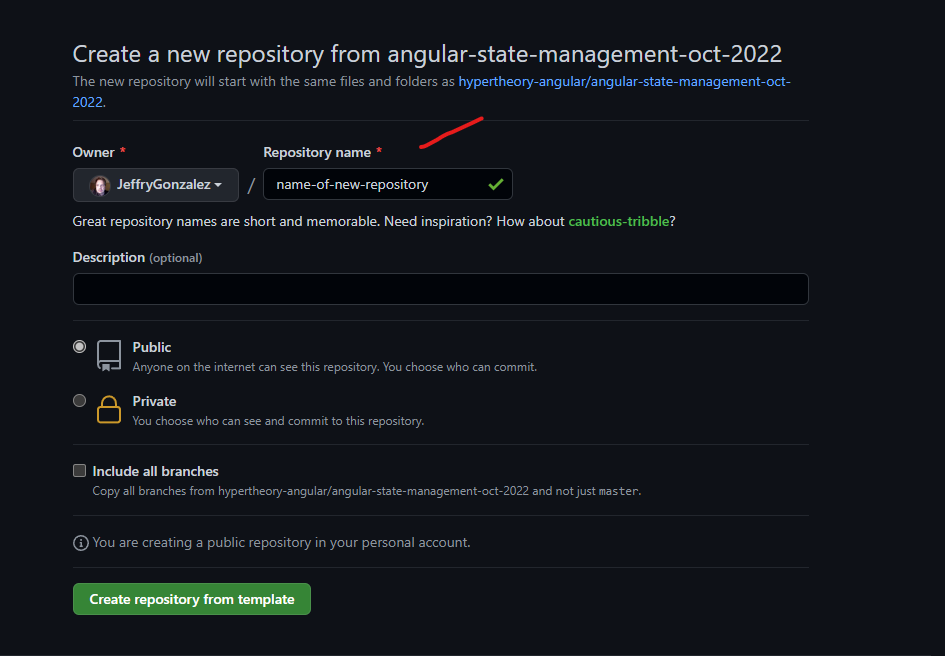
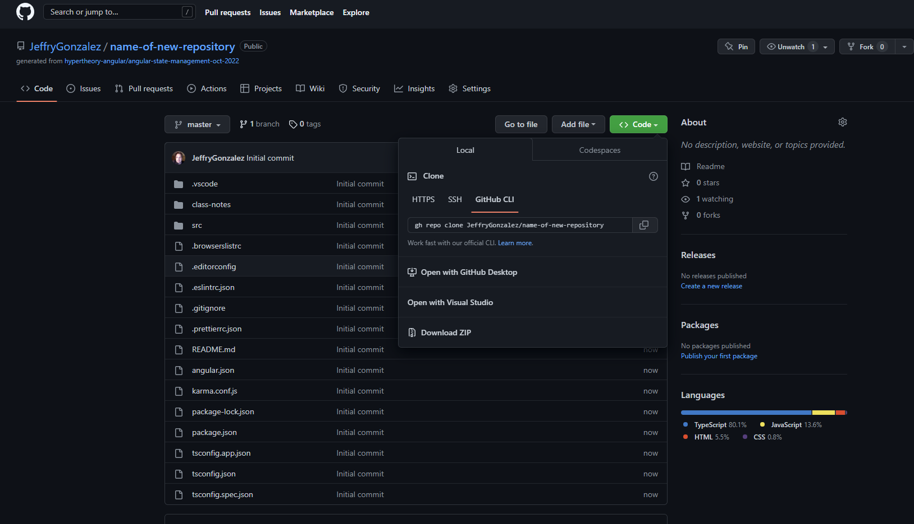

# Getting Jeff's Code

If you ever want to "reset" or start over.

1. Ask Jeff to push his latest changes.
2. Go to https://github.com/hypertheory-angular/angular-state-management-oct-2022
3. You *must* be logged in to Github.
4. Click the big green "Use this Template Button"



5. Give your repo a new name in the *Repository name* field.
6. You can decide if you want it public or private.
7. "Include all branches" - up to you, I don't usually have branches in class.
8. Click the "Create repository from template" button.




9. Click the "Code" button, then make sure the **GITHUB CLI** tab is selected.
10. Click the "copy" button next to the command.
11. Open a Windows Terminal [> ]
12. Enter the following command:

```shell
cd dev
```

13. Paste in the gh repo command and hit enter:

```shell
gh repo clone JeffryGonzalez/name-of-new-repository
```

14. Change directory into the new repo you just pulled down.

```shell
cd ./name-of-new-repository
```

15. Run the following to install the node modules:

```shell
npm i
```

16. When that is done, run:

```shell
code .
```

To open it in VSCode.

In VS Code, type Control+BackTick (`)

Type `ng serve -o`

YOU ARE IN!
